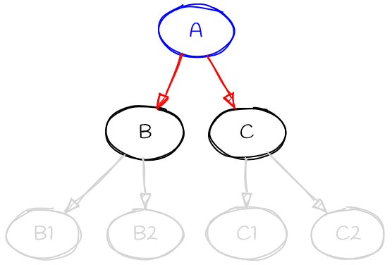

# More on Dependency Resolution

This article goes into more detail about pip's dependency resolution algorithm.
In certain situations, pip can take a long time to determine what to install,
and this article is intended to help readers understand what is happening
"behind the scenes" during that process.

```{note}
This document is a work in progress. The details included are accurate (at the
time of writing), but there is additional information, in particular around
pip's interface with resolvelib, which have not yet been included.

Contributions to improve this document are welcome.
```

## The dependency resolution problem

The process of finding a set of packages to install, given a set of dependencies
between them, is known to be an [NP-hard](https://en.wikipedia.org/wiki/NP-hardness)
problem. What this means in practice is roughly that the process scales
*extremely* badly as the size of the problem increases. So when you have a lot
of dependencies, working out what to install will, in the worst case, take a
very long time.

The practical implication of that is that there will always be some situations
where pip cannot determine what to install in a reasonable length of time. We
make every effort to ensure that such situations happen rarely, but eliminating
them altogether isn't even theoretically possible. We'll discuss what options
yopu have if you hit a problem situation like this a little later.

## Python specific issues

Many algorithms for handling dependency resolution assume that you know the
full details of the problem at the start - that is, you know all of the
dependencies up front. Unfortunately, that is not the case for Python packages.
With the current package index structure, dependency metadata is only available
by downloading the package file, and extracting the data from it. And in the
case of source distributions, the situation is even worse as the project must
be built after being downloaded in order to determine the dependencies.

Work is ongoing to try to make metadata more readily available at lower cost,
but at the time of writing, this has not been completed.

As downloading projects is a costly operation, pip cannot pre-compute the full
dependency tree. This means that we are unable to use a number of techniques
for solving the dependency resolution problem. In practice, we have to use a
*backtracking algorithm*.

## Dependency metadata

It is worth discussing precisely what metadata is needed in order to drive the
package resolution process. There are essentially three key pieces of
information:

* The project name
* The release version
* The dependencies themselves

There are other pieces of data (e.g., extras, python version restrictions, wheel
compatibility tags) which are used as well, but they do not fundamentally
alter the process, so we will ignore them here.

The most important information is the project name and version. Those two pieces
of information identify an individual "candidate" for installation, and must
uniquely identify such a candidate. Name and version must be available from the
moment the candidate object is created. This is not an issue for distribution
files (sdists and wheels) as that data is available from the filename, but for
unpackaged source trees, pip needs to call the build backend to ask for that
data. This is done before resolution proper starts.

The dependency data is *not* requested in advance (as noted above, doing so
would be prohibitively costly, and for a backtracking algorithm it isn't
needed). Instead, pip requests dependency data "on demand", as the algorithm
starts to check that particular candidate.

One particular implication of the lazy fetching of dependency data is that
often, pip *does not know* things that might be obvious to a human looking at
the dependency tree as a whole. For example, if package A depends on version
1.0 of package B, it's obvious to a human that there's no point in looking at
other versions of package B. But if pip starts looking at B before it has
considered A, it doesn't have access to A's dependency data, and so has no way
of knowing that looking at other versions of B is wasted work. And worse still,
pip cannot even know that there's vital information in A's dependencies.

This latter point is a common theme with many cases where pip takes a long time
to complete a resolution - there's information pip doesn't know at the point
where it makes a "wrong" choice. Most of the heuristics added to the resolver
to guide the algorithm are designed to guess correctly in the face of that
lack of knowledge.

## The resolver and the finder

So far, we have been talking about the "resolver" as a single entity. While that
is mostly true, the process of getting package data from an index is handled
by another component of pip, the "finder". The finder is responsible for
feeding candidates to the resolver, and has a key role to play in selecting
suitable candidates.

Note that the resolver is *only* relevant for packages fetched from an index.
Candidates coming from other sources (local source directories, PEP 508
direct URL references) do *not* go through the finder, and are merged with the
candidates provided by the finder as part of the resolver's "provider"
implementation.

As well as determining what versions exist in the index for a given project,
the finder selects the best distribution file to use for that candidate. This
may be a wheel or a source distribution, and precisely what is selected is
controlled by wheel compatibility tags, pip's options (whether to prefer binary
or source) and metadata supplied by the index. In particular, if a file is
marked as only being for specific Python versions, the file will be ignored by
the finder (and the resolver may never even see that version).

The finder also provides candidates for a project to the resolver in order of
preference - the provider implements the rule that later versions are preferred
over older versions, for example.

## The resolver algorithm

The resolver itself is based on a separate package, [resolvelib](https://pypi.org/project/resolvelib/).
This implements an abstract backtracking resolution algorithm, in a way that is
independent of the specifics of Python packages - those specifics are abstracted
away by pip before calling the resolver.

Pip's interface to resolvelib is in the form of a "provider", which is the
interface between pip's model of packages and the resolution algorithm. The
provider deals in "candidates" and "requirements" and implements the following
operations:

* `identify` - implements identity for candidates and requirements. It is this
  operation that implements the rule that candidates are identified by their
  name and version, for example.
* `get_preference` - this provides information to the resolver to help it choose
  which requirement to look at "next" when working through the resolution
  process.
* `find_matches` - given a set of constraints, determine what candidates exist
  that satisfy them. This is essentially where the finder interacts with the
  resolver.
* `is_satisfied_by` - checks if a candidate satisfies a requirement. This is
  basically the implementation of what a requirement meams.
* `get_dependencies` - get the dependency metadata for a candidate. This is
  the implementation of the process of getting and reading package metadata.

Of these methods, the only non-trivial one is the `get_preference` method. This
implements the heuristics used to guide the resolution, telling it which
requirement to try to satisfy next. It's this method that is responsible for
trying to guess which route through the dependency tree will be most productive.
As noted above, it's doing this with limited information. See the following
diagram



When the provider is asked to choose between the red requirements (A->B and
A->C) it doesn't know anything about the dependencies of B or C (i.e., the
grey parts of the graph).

Pip's current implementation of the provider implements `get_preference` as
follows:

* Prefer if any of the known requirements is "direct", e.g. points to an
    explicit URL.
* If equal, prefer if any requirement is "pinned", i.e. contains
    operator ``===`` or ``==``.
* If equal, calculate an approximate "depth" and resolve requirements
    closer to the user-specified requirements first.
* Order user-specified requirements by the order they are specified.
* If equal, prefers "non-free" requirements, i.e. contains at least one
    operator, such as ``>=`` or ``<``.
* If equal, order alphabetically for consistency (helps debuggability).
